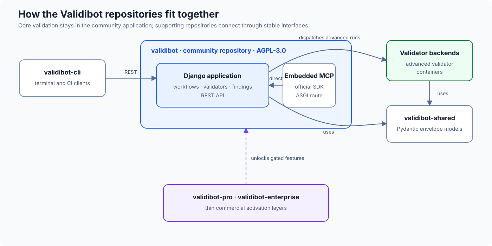

<div align="center">

<picture>
  
</picture>

# Validibot

**Open-source data validation engine**

[](https://github.com/mcquilleninteractive/validibot/actions)
[](https://scorecard.dev/viewer/?uri=github.com/mcquilleninteractive/validibot)
[](LICENSE)
[](https://www.python.org/)
[](https://djangoproject.com/)

[User Documentation](https://docs.validibot.com/) •
[Developer Documentation](https://dev.validibot.com/) •
[Getting Started](https://docs.validibot.com/getting-started) •
[Community](https://github.com/mcquilleninteractive/validibot/discussions) •
[Pricing](https://validibot.com/pricing)

</div>

> [!IMPORTANT]
> I'm still actively developing this project. Features, APIs, and documentation are still evolving. But it's very operational so have a go and let me know what you think!

## Related Projects

Validibot is composed of several repositories that work together:

| Repository                                                                          | Description                                                                                            | License  |
| ----------------------------------------------------------------------------------- | ------------------------------------------------------------------------------------------------------ | -------- |
| **[validibot](https://github.com/mcquilleninteractive/validibot)**                       | Core platform (this repo) — Django web application, REST API, workflow engine, and built-in validators | AGPL-3.0 |
| **[validibot-cli](https://github.com/mcquilleninteractive/validibot-cli)**               | Command-line interface for running validations from terminals and scripts                              | MIT      |
| **[validibot-validator-backends](https://github.com/mcquilleninteractive/validibot-validator-backends)** | Validator backends for advanced validators (EnergyPlus™, FMU) — run as isolated Docker containers      | MIT      |
| **[validibot-shared](https://github.com/mcquilleninteractive/validibot-shared)**         | Shared Pydantic models defining the data interchange format between core and validators                | MIT      |

How they fit together:



The full, annotated version of this diagram lives in the
[developer docs](https://dev.validibot.com/).

---

## What is Validibot?

Validibot is an **open-source data validation platform** that transforms fragmented validation processes into systematic, reliable validation workflows. Originally built for validating building energy models (using [EnergyPlus™](https://energyplus.net/)), it's now designed to handle any structured data validation, including validation workflows that need complex logic or simulations (e.g. running an FMU file).

**Key problems Validibot solves:**

- **Complicated manual processes**: Your current data validation involves a number of tools and manual processes
- **Inconsistency**: Different teams implementing different validation logic for similar data
- **Fragmentation**: Validation scattered across codebases, scripts, and manual processes
- **Poor visibility**: No centralized view of validation results, trends, or failures
- **Limited reusability**: Validation logic written once can't easily be shared or reused

## Key Features

### Built-in ("Simple") Validators

These validators run directly in the Django/Celery worker process — no extra
infrastructure needed (validators are at various stages of development):

- **Basic Assertions**: Add signals and CEL assertions directly on a workflow step — no validator catalog required. The simplest way to validate JSON or XML payloads.
- **JSON Schema**: Validate JSON against JSON Schema drafts 4 through 2020-12
- **XML Schema (XSD)**: Validate XML against XSD, RelaxNG, or DTD schemas
- **Tabular (CSV/TSV)**: Validate tables of typed rows — required columns, column types, numeric ranges, string length, regex, enum membership, single and composite uniqueness, plus CEL row assertions
- **THERM**: Validate LBNL THERM thermal-analysis files (THMX/THMZ) — geometry closure, material property ranges, boundary-condition completeness, and reference integrity

### Advanced Validators

These validators run as isolated Docker container backends for heavier or domain-specific work:

- **EnergyPlus™**: Validate (and simulate) EnergyPlus IDF and epJSON building energy models
- **FMU**: Validate and simulate Functional Mock-up Units (FMI)
- **Portfolio Manager**: Validate ENERGY STAR® Portfolio Manager property reports (XLS, XLSX, XML) and multi-building ZIP collections — reporting periods, roster reconciliation, and EUI target (EUIt) comparisons
- **SHACL**: Validate RDF graphs (Turtle, JSON-LD, RDF/XML, N-Triples) against SHACL shapes — for example ASHRAE 223P, ASHRAE Guideline 36, Brick Schema, and Project Haystack 4
- **Schematron**: Validate XML against uploaded Schematron rules — for example EN 16931 or Peppol BIS Billing 3.0 — with findings reported by their native rule IDs (e.g. BR-CO-15)
- **AI Assisted**: Validate JSON or text against natural-language criteria using language models
- **Custom**: Bring your own validator backend container image

Validibot defines a simple container interface for validator backends: read an input envelope, perform validation, write an output envelope. This makes it straightforward to package any validation logic as a backend. See the [Container Interface Guide](https://dev.validibot.com/overview/validator_architecture/) for the full specification.

### Workflow Engine

Orchestrate multi-step validation pipelines:

- Ordered sequence of validation steps
- Mix simple and advanced validators
- Action steps for notifications (Slack)
- Versioned workflows for safe migrations

### Full REST API

Integrate validation into your existing tools:

```bash
# Submit a file for validation
curl -X POST https://your-instance.com/api/v1/submissions/ \
  -H "Authorization: Bearer $TOKEN" \
  -F "file=@model.idf" \
  -F "workflow_id=wf_abc123"
```

See the [API documentation](https://docs.validibot.com/api) for complete reference.

(And check out the **[validibot-cli](https://github.com/mcquilleninteractive/validibot-cli)** for a simple way to access the API...)

### MCP Server for AI Agents

Validibot includes a [Model Context Protocol](https://modelcontextprotocol.io/) (MCP) endpoint that exposes validation workflows to AI agents. It uses the official MCP Python SDK and is mounted at `<SITE_URL>/mcp` in the normal Django ASGI application:

- `list_workflows` / `get_workflow` — discover workflows available to the caller
- `start_validation` — submit a bounded file with a database-idempotent request
- `get_validation_run` / `list_validation_findings` — poll status and page through results

The implementation is open AGPL community code and calls Django application services directly. The route is activated only when the installed license includes the Pro `mcp_server` feature; Community returns 404. No second container, hostname, private HTTP proxy, or MCP service credential is required. See the [MCP documentation](https://dev.validibot.com/mcp/) for setup.

## Quick Start

### Prerequisites

- Docker Engine and Docker Compose
- [git](https://git-scm.com/downloads) and the [just](https://just.systems/) command runner
- 4GB RAM minimum (8GB recommended)

### Local Evaluation

```bash
# Clone the repository
git clone https://github.com/mcquilleninteractive/validibot.git
cd validibot

# Copy local environment templates
mkdir -p .envs/.local
cp .envs.example/.local/.django .envs/.local/.django
cp .envs.example/.local/.postgres .envs/.local/.postgres

# Edit .envs/.local/.django and set the three required values:
#   DJANGO_SECRET_KEY          python -c "import secrets; print(secrets.token_urlsafe(50))"
#   DJANGO_MFA_ENCRYPTION_KEY  python -c "from cryptography.fernet import Fernet; print(Fernet.generate_key().decode())"
#   SUPERUSER_PASSWORD         your admin login password
# The app will not start locally without the secret key and MFA key.
# .envs/.local/.postgres works as-is — no changes needed.

# Start the local stack
just local up
```

Open http://localhost:8000 and sign in as `admin` with the `SUPERUSER_PASSWORD` you set in `.envs/.local/.django`.

If you purchased Pro or Enterprise, copy `.envs.example/.local/.build` to `.envs/.local/.build`, set `VALIDIBOT_COMMERCIAL_PACKAGE` to an exact version like `validibot-pro==0.1.0` or to a quoted exact wheel URL on `pypi.validibot.com` that includes `#sha256=...`, and point `VALIDIBOT_COMMERCIAL_NETRC` at the mode-0600 credential file from your purchase email. Then select the matching Pro or Enterprise settings module and run `just local build` before `just local up`.

For the full self-host walkthrough, see [Run Validibot Locally](https://dev.validibot.com/deployment/deploy-local/).

## Deployment

Validibot is designed for **deployment on your own infrastructure**. You control your infrastructure, data, and security posture.

> [!IMPORTANT]
> Before deploying, [verify the release tag](SECURITY.md#verifying-validibot-releases) you'll be running. Git checks the tag was signed by a Validibot maintainer; non-zero exit means stop.

### Production Stack

| Component         | Purpose                                                   |
| ----------------- | --------------------------------------------------------- |
| **Web**           | Django ASGI application (UI, API, and Pro-gated MCP)      |
| **Worker**        | Celery workers for async validation                       |
| **PostgreSQL**    | Primary database                                          |
| **Redis**         | Task queue broker and cache                               |
| **Reverse Proxy** | User-provided (Caddy, Traefik, nginx) for TLS termination |

### Deployment Options

- **Local evaluation**: Start with [Run Validibot Locally](https://dev.validibot.com/deployment/deploy-local/).
- **Docker Compose**: Recommended for most self-hosted production deployments. See [Deploy with Docker Compose](https://dev.validibot.com/deployment/deploy-docker-compose/).
- **Google Cloud Run (GCP)**: See [Deploy to GCP](https://dev.validibot.com/deployment/deploy-gcp/).
- **AWS**: See [Deploy to AWS](https://dev.validibot.com/deployment/deploy-aws/) for the current status and interim guidance.
- **Kubernetes**: (planned...)

### Reverse Proxy

Validibot doesn't include a reverse proxy by default. You'll need to set up your own for TLS termination. We recommend **[Caddy](https://caddyserver.com/)** for its automatic HTTPS with zero configuration.

See the [Reverse Proxy Guide](https://dev.validibot.com/deployment/reverse-proxy/) for setup instructions, including examples for nginx, Traefik, and Cloudflare Tunnel.

### Security Considerations

> [!IMPORTANT]
> A rootful Docker socket grants root-equivalent privileges on the host. For
> production deployments, rootless Docker is the supported hardened path.
> Rootless Podman's Docker-compatible API is experimental and should be
> qualified with Validibot's full validator integration suite before use.

> [!WARNING]
> **Only run validator backend images that you have built and control yourself.** Never run third-party or untrusted container images as validator backends—they execute with access to your validation data and could potentially compromise your system.

Key security features:

- **Network isolation**: Validator backend containers run with `network_mode='none'`
- **Dropped capabilities**: All Linux capabilities are dropped (`cap_drop=ALL`)
- **No privilege escalation**: `no-new-privileges` prevents setuid/setgid abuse
- **Read-only filesystem**: Root filesystem is read-only with writable tmpfs on `/tmp`
- **Non-root execution**: Validator backend containers run as UID 1000, not root
- **Resource limits**: CPU, memory, PID, and timeout limits on all validator backend containers
- **Automatic cleanup**: Orphaned containers are cleaned up via the Ryuk pattern
- **Non-root processes**: Web and worker containers run as non-root users

For the operational security checklist, see [Docker Compose Deployment Responsibility](https://dev.validibot.com/deployment/docker-compose-responsibility/) and the [Go-Live Checklist](https://dev.validibot.com/deployment/go-live-checklist/).

## Open-Core Licensing

Validibot follows an **open-core model**. The core platform is free and open-source under AGPL-3.0, with optional commercial extensions for teams that need additional features.

See [Pricing](https://validibot.com/pricing) for commercial product details. Need something else? [Get in touch](mailto:sales@mcquilleninteractive.com).

### License Details

| Repository              | License    | Purpose                         |
| ----------------------- | ---------- | ------------------------------- |
| `validibot` (this repo) | AGPL-3.0   | Core platform                   |
| `validibot-validator-backends` | MIT | Validator backend container images    |
| `validibot-cli`         | MIT        | Command-line interface          |
| `validibot-shared`      | MIT        | Shared library for integrations |
| `validibot-pro`         | Commercial | Pro tier features               |

The AGPL-3.0 license requires that if you modify Validibot and provide it as a network service, you must make your modifications available under the same license. For commercial use without this requirement, [contact us](mailto:licensing@mcquilleninteractive.com) for a commercial license.

## Documentation

| Resource                                                      | Description                      |
| ------------------------------------------------------------- | -------------------------------- |
| [Getting Started](https://docs.validibot.com/getting-started) | First steps with Validibot       |
| [Self-Host Deployment Guide](https://dev.validibot.com/deployment/deploy-local/) | First-time local setup and self-host deployment paths |
| [User Guide](https://docs.validibot.com/user-guide)           | How to use the platform          |
| [API Reference](https://docs.validibot.com/api)               | REST API documentation           |
| [Developer Docs](https://dev.validibot.com/)                  | Contributing and architecture    |
| [CLI Documentation](https://docs.validibot.com/cli)           | Command-line interface usage     |

## Support

### Community Support

- **GitHub Discussions**: [Ask questions and share ideas](https://github.com/mcquilleninteractive/validibot/discussions)
- **GitHub Issues**: [Report bugs](https://github.com/mcquilleninteractive/validibot/issues)

> [!NOTE]
> Community support is provided on a best-effort basis (by me). For guaranteed response times and priority support, consider [Validibot Pro](https://validibot.com/pricing).

### Commercial Support

Pro and Enterprise customers receive:

- Priority email support
- Guaranteed response times (SLA)
- Direct access to the development team
- Assistance with deployment and integration

[Contact Sales](mailto:sales@mcquilleninteractive.com) to learn more.

## Contributing

We welcome contributions! Whether it's:

- Reporting bugs
- Suggesting features
- Improving documentation
- Submitting pull requests

See [CONTRIBUTING.md](CONTRIBUTING.md) for guidelines.

### Development Setup

```bash
# Clone the repo
git clone https://github.com/mcquilleninteractive/validibot.git
cd validibot

# Install dependencies with uv
uv sync --group dev

# Set up environment
source set-env.sh

# Run tests
uv run pytest

# Run linter
uv run ruff check
```

See the [Developer Docs](https://dev.validibot.com/) for complete instructions.

## Roadmap

Track our progress and upcoming features:

- [GitHub Issues & Milestones](https://github.com/mcquilleninteractive/validibot/milestones)
- [Release Notes](https://github.com/mcquilleninteractive/validibot/releases)

## Acknowledgments

Validibot is built on a number of open-source software projects, including:

- [Django](https://djangoproject.com/) - The web framework
- [Celery](https://docs.celeryq.dev/) - Distributed task queue
- [EnergyPlus](https://energyplus.net/) - Building energy simulation (U.S. Department of Energy)
- [FMPy](https://github.com/CATIA-Systems/FMPy) - FMU simulation library
- [Cookiecutter Django](https://github.com/cookiecutter/cookiecutter-django/) - Project template

## License

Validibot is licensed under the [GNU Affero General Public License v3.0](LICENSE).

```
Copyright (c) 2025-2026 McQuillen Interactive Pty. Ltd.

This program is free software: you can redistribute it and/or modify
it under the terms of the GNU Affero General Public License as published
by the Free Software Foundation, either version 3 of the License, or
(at your option) any later version.
```

## Trademarks

The Validibot name, logo, robot character, and associated branding are trademarks of **McQuillen Interactive Pty. Ltd.** and may not be used without permission. This trademark policy does not limit your rights under the AGPL-3.0 license to use, modify, and distribute the software.

EnergyPlus™ is a trademark of the U.S. Department of Energy. Validibot is not affiliated with, endorsed by, or sponsored by the U.S. Department of Energy or the National Renewable Energy Laboratory (NREL).

For trademark usage guidelines, contact [hello@mcquilleninteractive.com](mailto:hello@mcquilleninteractive.com).

---

<div align="center">

[Website](https://validibot.com) •
[Docs](https://docs.validibot.com) •
[Community](https://github.com/mcquilleninteractive/validibot/discussions) •
[Contact](mailto:hello@mcquilleninteractive.com)

</div>
