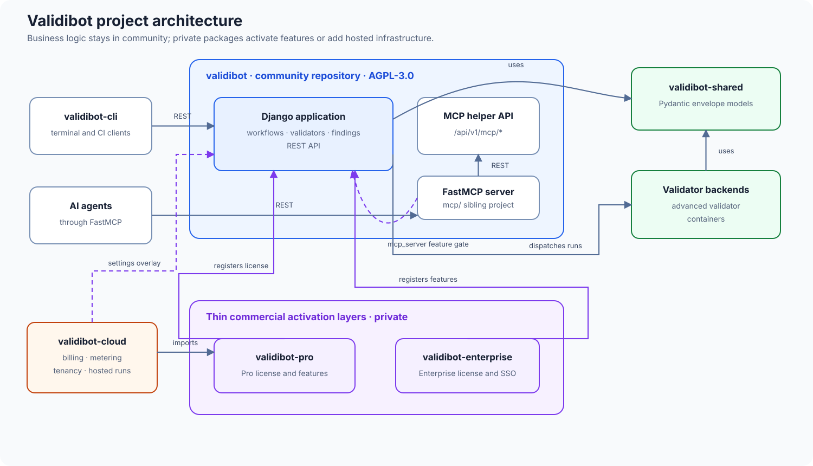

# Developer Documentation

This documentation is for engineers, technical partners, and self-host operators working directly from the `validibot` repository. If you're looking for day-to-day product usage guidance, see the [User Guide](https://docs.validibot.com/) instead.

Deployment pages in this repo are customer-facing for self-hosted installs. Hosted-cloud operator workflows belong in the private internal docs, not here.

---

## Getting Started

New to the codebase? Start here:

1. **[Platform Overview](overview/platform_overview.md)** — What Validibot is and the problems it solves
2. **[How It Works](overview/how_it_works.md)** — Technical walkthrough of the validation lifecycle
3. **[Quick Reference](quick_reference.md)** — Core concepts and basic usage patterns
4. **[Run Validibot Locally](deployment/deploy-local.md)** — First-time local setup for self-hosting and evaluation

---

## Architecture

How the pieces fit together — this is the canonical project-shape diagram
(the README and the cloud repo's docs point here rather than drawing their
own):

The rule of thumb behind the shape: **business logic lives in community**,
gated by feature flags; `validibot-pro`/`-enterprise` are thin activation
layers; `validibot-cloud` adds hosting-only concerns on top. See
[Commercial Extensions](overview/commercial_extensions.md) for the details.

Understand how the system is built:

- **[Terminology](overview/terminology.md)** — Canonical glossary: validator, simple validator, advanced validator, validator backend, execution backend, validator runner, plus trust and versioning vocabulary
- **[Trust Architecture](overview/trust-architecture.md)** — The four trust invariants (caller, contract, isolation, evidence), threat model, and how the platform enforces them across web/API/CLI/MCP/x402
- **[Evidence Bundles](overview/evidence-bundles.md)** — Manifest schema, retention policy, signed-credential link, export UX
- **[Workflow Engine](overview/workflow_engine.md)** — How ValidationRunService orchestrates steps
- **[Step Processor](overview/step_processor.md)** — The processor pattern for validator execution
- **[Plugin Architecture](overview/plugin_architecture.md)** — The shared registration and sync model for validators and actions
- **[Validator Architecture](overview/validator_architecture.md)** — The container interface for advanced validators, run-scoped isolation, sentinel run-completion contract
- **[Execution Backends](overview/execution_backends.md)** — How dispatch to Docker vs Cloud Run is selected
- **[Submission Modes](overview/request_modes.md)** — How API payload shapes are detected
- **[Settings Reference](overview/settings.md)** — Environment variables and feature flags
- **[Dashboard](dashboard.md)** — Architecture and extension points for the dashboard module
- **[Commercial Extensions](overview/commercial_extensions.md)** — How Pro and Enterprise packages plug in

---

## How-To Guides

Step-by-step instructions for common tasks:

- **[Using a Workflow via the API](how-to/use-workflow.md)** — Submit data programmatically
- **[Author Workflow Steps](how-to/author-workflow-steps.md)** — Configure validation steps in the UI
- **[Configure Storage](how-to/configure-storage.md)** — Set up file storage backends
- **[Configure Scheduled Tasks](how-to/configure-scheduled-tasks.md)** — Set up background jobs
- **[Add a Form](how-to/add-a-form.md)** — Django Crispy Forms patterns
- **[Configure MFA](how-to/configure-mfa.md)** — Multi-factor authentication settings and extension points
- **[Extend the Audit Log](how-to/extend-the-audit-log.md)** — Add new action codes, extend the field whitelist, capture new models
- **[Manage Organizations & Projects](organization_management.md)** — Admin workflows

---

## Data Model

The entities that make up Validibot:

- **[Data Model Overview](data-model/index.md)** — Core entities and relationships
- **[Projects](data-model/projects.md)** — Organization-scoped namespaces
- **[Submissions](data-model/submissions.md)** — Content being validated
- **[Runs](data-model/runs.md)** — Validation execution tracking
- **[Steps](data-model/steps.md)** — Individual validation operations
- **[Workflow Data Architecture](overview/workflow_data_architecture.md)** — Scope, provenance, namespaces, signals, step I/O, and artifact boundaries
- **[Workflow Signals and Step I/O Reference](data-model/signals.md)** — Detailed models, constraints, resolution, and runtime behavior
- **[Step I/O Tutorial](data-model/signals-tutorial-example.md)** — End-to-end walkthrough of I/O contracts, bindings, promotions, derivations, and runtime traces
- **[Results](data-model/results.md)** — Findings, artifacts, and summaries
- **[Workflow Versioning](data-model/workflow-versioning.md)** — The trust contract: contract fields, validator semantic digests, ruleset/resource immutability, the `audit_workflow_versions` command, evidence manifests
- **[Users & Roles](data-model/users_roles.md)** — Organization membership
- **[Deletions](data-model/deletions.md)** — How deletions are managed

---

## Deployment

Deploy Validibot to production:

- **[Deployment Overview](deployment/overview.md)** — Choose the right deployment target (the three targets: local, self-hosted, GCP)
- **[Run Validibot Locally](deployment/deploy-local.md)** — Quickest path to a running app
- **[Deploy with Docker Compose](deployment/deploy-docker-compose.md)** — Single-host self-hosting (developer-facing reference)
- **[Deploy to GCP](deployment/deploy-gcp.md)** — Managed cloud deployment on Google Cloud (`just gcp deploy-all` covers web, worker, scheduler, and optionally MCP)
- **[Deploy to AWS](deployment/deploy-aws.md)** — Current status and interim guidance
- **[Google Cloud Run Deep Dive](google_cloud/deployment.md)** — Full Cloud Run runbook
- **[Docker Compose Responsibility](deployment/docker-compose-responsibility.md)** — Operator responsibilities for self-hosting
- **[Scheduled Jobs (GCP)](google_cloud/scheduled-jobs.md)** — Cloud Scheduler setup
- **[Scheduled Tasks (Docker Compose)](how-to/configure-scheduled-tasks.md)** — Celery + Celery Beat
- **[Important Notes](deployment/important_notes.md)** — Common deployment gotchas

### Self-hosting (operator-facing)

The customer-facing self-hosting docs live outside this dev-docs site at
`docs/operations/self-hosting/`. They're written for someone running their own
Validibot install on their own VM, not for someone hacking on the codebase:

- **[Self-Hosting Overview](https://github.com/mcquilleninteractive/validibot/blob/main/docs/operations/self-hosting/overview.md)** — three deployment targets, what's on the VM, recommended sizing, telemetry posture
- **[Install](https://github.com/mcquilleninteractive/validibot/blob/main/docs/operations/self-hosting/install.md)** — substrate-generic install on any Linux + Docker host
- **[Configuration](https://github.com/mcquilleninteractive/validibot/blob/main/docs/operations/self-hosting/configuration.md)** — env file reference, deployment profiles, settings module switching
- **[Backups](https://github.com/mcquilleninteractive/validibot/blob/main/docs/operations/self-hosting/backups.md)** and **[Restore](https://github.com/mcquilleninteractive/validibot/blob/main/docs/operations/self-hosting/restore.md)** — application-level backup/restore with manifests and restore drills
- **[Upgrades](https://github.com/mcquilleninteractive/validibot/blob/main/docs/operations/self-hosting/upgrades.md)** — versioned upgrade lifecycle with idempotent retry
- **[Validator Images](https://github.com/mcquilleninteractive/validibot/blob/main/docs/operations/self-hosting/validator-images.md)** — what's installed, run-scoped isolation, image pinning
- **[Security Hardening](https://github.com/mcquilleninteractive/validibot/blob/main/docs/operations/self-hosting/security-hardening.md)** — recommended hardening checklist
- **[Support Bundle](https://github.com/mcquilleninteractive/validibot/blob/main/docs/operations/self-hosting/support-bundle.md)** — what's redacted, support workflow contract
- **[Troubleshooting](https://github.com/mcquilleninteractive/validibot/blob/main/docs/operations/self-hosting/troubleshooting.md)** — common issues
- **[Release Notes Policy](https://github.com/mcquilleninteractive/validibot/blob/main/docs/operations/self-hosting/release-notes-policy.md)** — what every release announces
- **[Operator Recipes](https://github.com/mcquilleninteractive/validibot/blob/main/docs/operations/self-hosting/operator-recipes.md)** — full `just self-hosted` reference
- **[Doctor Check IDs](https://github.com/mcquilleninteractive/validibot/blob/main/docs/operations/self-hosting/doctor-check-ids.md)** — every check ID and its fix
- **[DigitalOcean Provider Tutorial](https://github.com/mcquilleninteractive/validibot/blob/main/docs/operations/self-hosting/providers/digitalocean.md)** — first-supported VM provider tutorial

---

## Integrations

- **[MCP Server](mcp/index.md)** — Standalone FastMCP service that exposes validation workflows to AI agents (Claude, Cursor, Windsurf, etc.). Source, Dockerfile, and deploy recipes all live in this repo; license-gated at runtime.
---

## Testing

Run the test suite with `uv run --group dev pytest`. Integration and E2E tests
have their own `just` recipes.

See **[Testing Overview](how-to/testing.md)** for the full testing strategy,
including when to use each test layer and detailed guides for integration,
stress, and EnergyPlus E2E tests.
