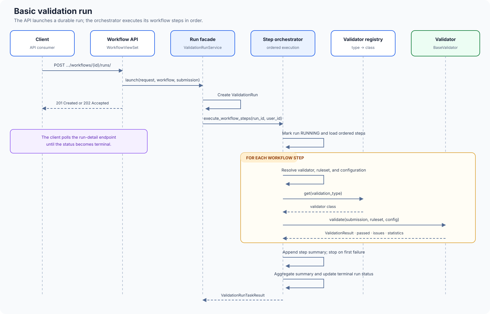

# How Validibot Works

This document provides a detailed technical walkthrough of how Validibot executes validation workflows, from initial API request to final results.

## System Overview

Validibot operates as an orchestration layer that coordinates validators to process submitted content according to predefined workflows. The system is designed around an asynchronous, event-driven architecture that can handle both quick validations and long-running processes.

```
┌─────────────────┐    ┌─────────────────┐    ┌─────────────────┐
│   Client API    │────│  Django Views   │────│    Services     │
│   Request       │    │   & ViewSets    │    │     Layer       │
└─────────────────┘    └─────────────────┘    └─────────────────┘
                                │                       │
                                ▼                       ▼
┌─────────────────┐    ┌─────────────────┐    ┌─────────────────┐
│   Data Models   │    │   Submissions   │    │ Worker / Jobs   │
│   (Workflows,   │◄───│   & Validation  │◄───│ (Cloud Run)     │
│   Runs, etc.)   │    │      Runs       │    │                 │
└─────────────────┘    └─────────────────┘    └─────────────────┘
                                                       │
                                                       ▼
                                              ┌─────────────────┐
                                              │   Validation    │
                                              │   Validators    │
                                              │   (JSON, XML,   │
                                              │    Custom)      │
                                              └─────────────────┘
```

## The Complete Validation Lifecycle

### Phase 1: Workflow Preparation

Before any validation can occur, workflows must be configured:

1. **Workflow Creation**: Administrators create workflows through the UI or API

   - Define workflow metadata (name, version, organization)
   - Configure validation steps in the desired order
   - Assign validators and rulesets to each step

2. **Validator Registration**: The system maintains a registry of available validators

   - Built-in validators (JSON Schema, XML Schema)
   - Custom validators specific to the organization
   - Each validator defines its capabilities and input requirements

3. **Ruleset Management**: Validation rules are managed separately from workflows
   - JSON Schema documents for structure validation
   - XML Schema (XSD) files for XML validation
   - Custom rule files for specialized validators
   - Rulesets can be versioned and shared across workflows

### Phase 2: Validation Initiation

When a client wants to validate content, they trigger the process through the API:

#### 2.1 Request Processing

```python
# Example API call to start validation (org-scoped routing).
POST /api/v1/orgs/{org_slug}/workflows/{workflow_identifier}/runs/
Content-Type: application/json

{
  "name": "user-upload.json",
  "content": "{ \"user\": { \"name\": \"John\" } }"
}
```

The `workflow_identifier` can be either the workflow's slug (preferred) or its numeric database ID.

The system supports multiple submission modes:

- **Raw Body Mode**: Content sent directly in request body
- **JSON Envelope Mode**: Content wrapped in JSON with metadata
- **Multipart Mode**: File uploads with additional form data

#### 2.2 Submission Creation

The `WorkflowViewSet.start_validation()` method processes the request:

1. **Content Ingestion**: The system extracts and normalizes the submitted content

   - Determines content type (JSON, XML, plain text, etc.)
   - Calculates SHA256 checksum for deduplication
   - Validates content size and format

2. **Submission Persistence**: A `Submission` record is created

   - Links to the target workflow and organization
   - Stores content either inline (for small text) or as file reference
   - Captures metadata about the submission source

3. **Validation Run Creation**: A `ValidationRun` record is created to track execution
   - Links the submission to the specific workflow version
   - Initializes with PENDING status
   - Records the user who triggered the validation
   - Records the application-selected immutable runtime profile; every new run
     uses the durable execution-attempt lifecycle

#### 2.3 Execution Dispatch

The validation work executes inline for simple validators or dispatches an
advanced backend to a pinned Cloud Run Service/retained Job deployment (GCP)
or Docker container (Docker Compose). The API returns:

- **201 Created**: If validation completes quickly
- **202 Accepted**: If managed/container execution is still running; clients poll for status

### Phase 3: Validation Execution

The `ValidationRunService` facade delegates execution to the `StepOrchestrator`,
which handles the actual validation work (either inline or coordinating a
pinned managed deployment). See [Service Layer Architecture](service_architecture.md) for the full
decomposition.

#### 3.1 Execution Setup

1. **Run Initialization**: The orchestrator loads the ValidationRun and associated data

   - Validates the run is in PENDING state
   - Loads the workflow and its configured steps
   - Marks the run as RUNNING with start timestamp

2. **Step Sequencing**: The orchestrator executes workflow steps in order
   - Each step is processed sequentially (parallel execution is planned for future versions)
   - Step execution is isolated - failures in one step don't prevent others from running

#### 3.2 Step Routing: Validators vs Actions

The `StepOrchestrator` routes each step to the appropriate handler based on its type:

**Validator Steps** use the `ValidationStepProcessor` abstraction:

```python
if step.validator:
    from validibot.validations.services.step_processor import get_step_processor

    processor = get_step_processor(validation_run, step_run)
    result = processor.execute()
```

**Action Steps** use the `StepHandler` protocol:

```python
else:
    handler = get_action_handler(step.action.action_type)
    result = handler.execute(run_context)
```

For detailed documentation on the processor pattern, see [Validation Step Processor Architecture](step_processor.md).

#### 3.3 Validator Step Execution

For validator steps, the processor pattern provides a clean separation of concerns:

1. **Processor Selection**: The factory chooses the appropriate processor

   - **SimpleValidationProcessor**: For inline validators (JSON Schema, XML Schema, Basic, THERM)
   - **AdvancedValidationProcessor**: For validators requiring dedicated compute (container-based: EnergyPlus, FMU; compute-intensive: AI)

2. **Validator Dispatch**: The processor calls the validator

   ```python
   engine = get_validator(validator.validation_type)
   result = engine.validate(
       validator=validator,
       submission=submission,
       ruleset=ruleset,
       run_context=run_context,
   )
   ```

   Container-based validators receive one storage workspace per execution
   attempt. Local Docker uses narrow read-only input and writable output mounts;
   GCP uses a distinct prefix plus a short-lived Credential Access Boundary
   token; the runtime identity has no ambient bucket access. A retry therefore
   cannot reuse the previous attempt's input or output path.

3. **Result Processing**: The validator returns a `ValidationResult` object
   - `passed`: Boolean (True/False) or None for async
   - `issues`: List of ValidationIssue objects with details
   - `assertion_stats`: Structured counts of evaluated assertions
   - `signals`: Extracted metrics for downstream steps (advanced validators)
   - `output_envelope`: Container output (advanced validators, sync mode only)
   - For advanced validators, a container `ValidationStatus.SUCCESS` is treated
     as a pass even if ERROR messages are present; the processor emits a warning
     and logs the discrepancy. Output-stage assertion failures still fail the step.

4. **Finding Persistence**: The processor saves findings to the database
   - Creates `ValidationFinding` records for each issue
   - Stores assertion counts for run summary
   - For async validators, preserves input-stage findings when callback arrives

#### How Findings Are Persisted

Every issue emitted by a validator becomes a `ValidationFinding` row. The model links to
both the `ValidationStepRun` that produced the issue and the parent `ValidationRun`.
The direct run foreign key is intentionally denormalized so dashboards and APIs can
aggregate findings by run or organization without an extra join through step runs.
To keep the duplication safe, the model copies the run from the step run during save
and raises a `ValidationError` if someone attempts to associate a finding with a
different run. This keeps the ORM focused on read performance while guaranteeing
relational integrity. After the run completes we roll these rows up into the
`ValidationRunSummary`/`ValidationStepRunSummary` tables so long-term reporting
remains possible even if old findings are purged.

##### How Processors Handle Step Lifecycle

The `ValidationStepProcessor` abstraction consolidates step lifecycle management:

1. **Processor creation** – `get_step_processor()` routes to the appropriate processor class based on validator type.

2. **Validator dispatch** -- The processor calls `engine.validate()` (and for advanced validators, `engine.post_execute_validate()`).

3. **Finding persistence** – `persist_findings()` creates `ValidationFinding` records:
   - For sync validators: all findings are persisted at once
   - For async validators: input-stage findings are persisted on launch, output-stage findings are appended when callback arrives

4. **Value storage** – Contract-keyed inputs and outputs are stored on the
   `ValidationStepRun` for downstream step assertions. Presentation summaries
   are not execution inputs.

5. **Step finalization** – `finalize_step()` sets `ended_at`, `duration_ms`, `status`, and `output` fields.

##### What happens inside the processor

The processor pattern provides clean separation of concerns:

1. **Step metadata is pulled from the database** – the `WorkflowStep` instance supplies the linked `Validator`, optional `Ruleset`, and the JSON `config` column.

2. **Action steps use handlers instead** – when `workflow_step.action` is set, the service uses the `StepHandler` protocol instead of processors. Handlers like `SlackMessageActionHandler` or `SignedCredentialActionHandler` expose strongly typed fields.

3. **Submission content is materialized once** -- the active `Submission` is hydrated from the `ValidationRun` so every validator works with the same snapshot of data.

4. **Assertion evaluation happens in validators** -- Validators evaluate CEL assertions during `validate()` (input-stage) and `post_execute_validate()` (output-stage for advanced validators). The validator merges assertions from both the validator's `default_ruleset` (evaluated first) and the step-level ruleset (evaluated second) into a single pass. Processors just persist the results.

5. **Error handling is centralized** -- Any exception raised by the validator is caught by the processor, which creates an error finding and finalizes the step as FAILED.

This design keeps the processor focused on lifecycle orchestration: the step definition owns the configuration, the validator owns domain logic and assertion evaluation, and the processor handles persistence and state transitions.

> **Authoring walkthrough:** see [How to Author Workflow Steps](../how-to/author-workflow-steps.md) for the complete UI flow.

#### 3.4 Validator Implementation

Each validator implements the `BaseValidator` interface:

```python
class JsonSchemaValidator(BaseValidator):
    def validate(self, submission, ruleset=None, config=None):
        # Load JSON Schema from ruleset
        schema = load_schema(ruleset)

        # Parse submission content as JSON
        data = json.loads(submission.get_content())

        # Run JSON Schema validation
        validator = jsonschema.Draft7Validator(schema)
        errors = list(validator.iter_errors(data))

        # Convert to Validibot format
        issues = [
            ValidationIssue(
                path=error.absolute_path, message=error.message, severity=Severity.ERROR
            )
            for error in errors
        ]

        return ValidationResult(passed=len(issues) == 0, issues=issues)
```

### Sequence Diagram: Basic Validation Run



### Phase 4: Result Aggregation

After all workflow steps complete we capture both the detailed findings and a durable summary:

#### 4.1 Summary Generation

Each `ValidationIssue` emitted by a validator becomes a `ValidationFinding` row tied to the current `ValidationStepRun` and `ValidationRun`. Once all steps finish, `build_run_summary_record()` aggregates those rows into two lightweight tables:

- **`ValidationRunSummary`** -- run-level severity counts, assertion totals, and status.
- **`ValidationStepRunSummary`** -- per-step severity counts and status.

The summary builder queries `ValidationFinding` and `ValidationStepRun` rows directly from the database rather than relying on in-memory metrics. This makes it safe to call in resume scenarios (async callbacks, retries) where earlier steps' findings are already persisted but not in the current process's memory.

These summary tables keep severity totals, assertion hit rates, and per-step health available even after old `ValidationFinding` rows are purged for retention.

#### 4.2 Run Status Updates

The ValidationRun is updated with final results:

- **Status**: One of `PENDING`, `RUNNING`, `SUCCEEDED`, `FAILED`, `CANCELED`, `TIMED_OUT`
- **State**: A simplified lifecycle state (`PENDING`, `RUNNING`, `COMPLETED`) derived from Status
- **Result**: A stable automation-friendly conclusion (`PASS`, `FAIL`, `ERROR`, `CANCELED`, `TIMED_OUT`, `UNKNOWN`) derived from Status, findings, and `error_category`
- **End Timestamp**: When execution completed
- **Duration**: Total execution time in milliseconds
- **Summary Record**: One-to-one link to `ValidationRunSummary` (accessed via `run.summary_record`)
- **Error**: Empty string for success, error message for terminal failures

#### 4.3 Artifact Storage

Any files generated during validation are stored as Artifact records:

- Validation reports in various formats
- Transformed or processed versions of input data
- Debug logs from validators
- Performance profiling data

### Phase 5: Result Delivery

#### 5.1 Synchronous Response (Quick Validations)

If validation completes within the timeout window, the API returns immediately:

```json
{
  "id": "2dd379f6-2425-4bae-8c23-61ed05ff1ebf",
  "status": "SUCCEEDED",
  "state": "COMPLETED",
  "result": "PASS",
  "workflow": {
    "id": 42,
    "name": "JSON Product Validation",
    "version": 1
  },
  "submission": {
    "name": "product.json",
    "checksum_sha256": "abc123..."
  },
  "steps": [
    {
      "step_id": 1,
      "name": "Schema Validation",
      "status": "PASSED",
      "issues": []
    }
  ],
  "started_at": "2023-10-05T14:30:00Z",
  "ended_at": "2023-10-05T14:30:02Z",
  "duration_ms": 2000
}
```

#### 5.2 Asynchronous Response (Long-running Validations)

For longer validations, the client receives a polling URL:

```json
{
  "id": "2dd379f6-2425-4bae-8c23-61ed05ff1ebf",
  "status": "RUNNING",
  "state": "RUNNING",
  "result": "UNKNOWN",
  "poll_url": "/api/v1/orgs/{org_slug}/runs/2dd379f6-2425-4bae-8c23-61ed05ff1ebf/",
  "started_at": "2023-10-05T14:30:00Z"
}
```

Clients can poll this URL to check status and retrieve results when complete.

## Advanced Features

### Content Type Detection

The system automatically detects content types using multiple strategies:

1. **HTTP Headers**: `Content-Type` header from the request
2. **File Extensions**: For uploaded files, extension-based detection
3. **Content Sniffing**: Analyzing content structure for JSON, XML, CSV, etc.
4. **Magic Bytes**: Binary file type detection for non-text formats

#### Submission File Types

Deterministic MIME headers are not enough for authoring decisions, so we classify every primary submission into a small set of broad **SubmissionFileType** values (JSON, XML, TEXT, YAML, PDF, BINARY, or UNKNOWN). Those values participate in separate admission and execution contracts:

- **Workflows** store an `allowed_file_types` array. Authors decide which primary file carriers may create a run. The workflow builder does not use this array to filter the validator catalog.
- **Validator input ports** declare the precise data formats, carrier types, extensions, media types, cardinality, and source scopes they consume. Each step stores an explicit binding from a port to its selected source.
- **Launch-time enforcement** verifies only the workflow's primary-submission admission contract plus structural, authorization, and runtime-availability requirements.
- **Step execution** resolves each selected source against its port contract. A concrete mismatch creates a structured failed-step finding; it does not invalidate the workflow definition or retroactively reject an otherwise admitted submission.

Incoming requests still provide concrete MIME types (`Content-Type` headers, multipart metadata, etc.) so storage helpers can pick safe extensions. After we ingest the payload we re-run lightweight detection; if the actual content clearly differs from the transport hint, we update the stored `SubmissionFileType` so downstream automation, reporting, and billing all see the canonical format.

### Error Handling and Recovery

The system implements robust error handling:

- **Graceful Degradation**: Individual step failures don't crash the entire run
- **Timeout Management**: Long-running validations are killed after configurable timeouts
- **Retry Logic**: Transient failures trigger automatic retries with exponential backoff
- **Circuit Breakers**: Repeated failures temporarily disable problematic validators

### Performance Optimization

Several optimizations ensure good performance:

- **Content Deduplication**: Identical submissions (by SHA256) reuse previous results
- **Lazy Loading**: Large files are streamed rather than loaded entirely into memory
- **Connection Pooling**: Database connections are pooled for efficiency
- **Result Caching**: Validation results are cached for repeated access

### Security and Access Control

Security is enforced at multiple levels:

- **Authentication**: All API endpoints require valid authentication
- **Organization Isolation**: Users can only access resources within their organizations
- **Role-Based Access**: Different roles have different permissions (viewer, executor, admin)
- **Content Validation**: Uploaded content is scanned for malicious patterns
- **Audit Logging**: All actions are logged for security auditing

## Monitoring and Observability

### Application Metrics

The system exposes rich metrics for monitoring:

- **Validation Throughput**: Runs per minute/hour/day
- **Success Rates**: Percentage of validations that pass/fail
- **Performance Metrics**: Average validation time by workflow and step
- **Error Rates**: Frequency of different types of validation failures
- **Resource Usage**: CPU, memory, and storage consumption

### Event Streaming

Key events are published for external consumption:

```python
# Events published during validation lifecycle
AppEventType.VALIDATION_RUN_CREATED
AppEventType.VALIDATION_RUN_STARTED
AppEventType.VALIDATION_RUN_SUCCEEDED
AppEventType.VALIDATION_RUN_FAILED
AppEventType.VALIDATION_RUN_STEP_STARTED
AppEventType.VALIDATION_RUN_STEP_PASSED
AppEventType.VALIDATION_RUN_STEP_FAILED
```

These events enable integration with monitoring systems, alerting platforms, and analytics tools.

### Debugging Support

When validations fail, the system provides rich debugging information:

- **Step-by-step Execution Logs**: Detailed logs from each validation step
- **Content Snapshots**: Preserved copies of submitted content for reproduction
- **Configuration Snapshots**: The exact configuration used for the validation
- **Timing Information**: Performance profiling to identify bottlenecks
- **Stack Traces**: Full error details when validators throw exceptions

## Future Enhancements

Several enhancements are planned for future versions:

### Parallel Step Execution

Currently, workflow steps execute sequentially. Future versions will support:

- Parallel execution of independent steps
- Dependency graphs to control execution order
- Resource allocation and scheduling optimization

### Advanced Workflow Features

- **Conditional Steps**: Execute steps based on previous results
- **Dynamic Workflows**: Generate workflow steps programmatically
- **Workflow Templates**: Reusable workflow patterns
- **Step Libraries**: Shared marketplace of validation steps

### Enhanced Reporting

- **Real-time Dashboards**: Live updating validation metrics
- **Trend Analysis**: Historical analysis of validation patterns
- **Custom Reports**: User-defined reports and visualizations
- **Export Capabilities**: Export results in multiple formats

### Integration Enhancements

- **Webhook Improvements**: Rich webhook payloads with filtering
- **GraphQL API**: Alternative API interface for complex queries
- **CLI Tools**: Command-line interface for automation
- **IDE Plugins**: Integration with development environments

This architecture provides a solid foundation for scalable, reliable data validation while remaining flexible enough to adapt to evolving requirements.

## Related Documentation

- [Service Layer Architecture](service_architecture.md) — how the service layer is decomposed into focused modules
- [Step Processor Architecture](step_processor.md) — processor pattern details
- [Workflow Engine](workflow_engine.md) — higher-level orchestration
- [Validator Architecture](validator_architecture.md) — execution backends
